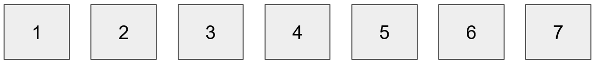

## Lottery
### 게임 방법
1. +3 번째 블록해시의 첫 두 글자 맞추기 '0xab.......'
    - a. 전송된 트랜잭션이 들어가는 +3의 블록 해시와 값을 비교
2. 팟 머니
    - a. 결과가 나왔을 때 사용자가 보낸 돈을 팟 머니에 적립
    - b. 여럿이 맞추었을 때, 가장 먼저 맞춘 사람이 팟 머니 획득
    - c. 두 글자 중 한 글자를 맞추었을 때는 보낸 돈 회수.
    - d. 결과값을 검증할 수 없을 때는 보낸 돈 회수.

- 3번 블록에선 6번 블록해시 값에 배팅
- 7번 블록 이상에서 결과 확인 가능

### Installation
트러플 : 이더리움 블록체인의 디앱 개발 프레임워크로 솔리디티도 포함한다.
- npm -g install truffle@5.0.2

가나슈 : 로컬에 이더리움 블록체인 가상 네트워크를 생성하여 Smart Contract와 MetaMask 송금도 테스트 해볼 수 있는 개발 툴.
- npm -g install ganache-cli

VSCode Packages
- solidity